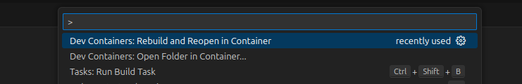
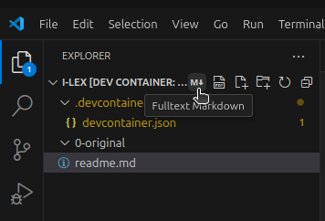
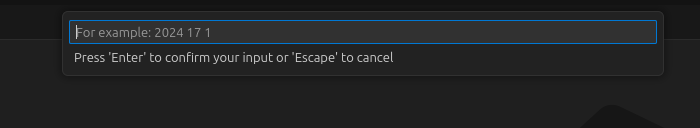
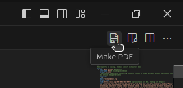

# Markdown Workflow

## Download

Grab the template.zip from the releases page.

## Usage

1. Copy the Word documents in the 0-original folder.
2. Run the Fulltext Markdown program
3. Modify the markdown files
4. Run the PDF Generator

### Load the Environment

Load the current folder in the container (you should be notified)

### Generate Markdown files
- from the command palette (Ctrl-Shift-P)
- from the icon on the left side (for all files)

- Insert the year issue and volume

### Generate PDF files
- from the command palette (Ctrl-Shift-P)
- from the icon on the left side next to the Fulltext Markdown button (for all files)
- from the icon on the right side (for the currently open .md file)

